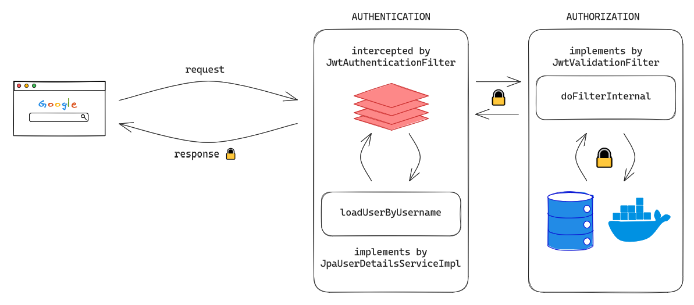

# Guia de configuracion de Spring Security (SC) e implementacion con JWT


## Autorizacion Spring Security
Cuando un cliente envía una solicitud al servidor, la solicitud pasará por una secuencia/cadena de filtros antes de llegar al servlet de destino que es realmente responsable de procesar la solicitud segun la siguiente configuracion inicial.
```java
@Configuration
public class SpringSecurityAuthorization {
    @Bean
    SecurityFilterChain filterChain (HttpSecurity httpSecurity) throws Exception {
    return httpSecurity.authorizeHttpRequests()
        //Los antMatchers seran nuestras reglas para autorizar diferentes recursos a nuestra conveniencia
        .antMatchers(HttpMethod.POST, "/login").permitAll()
        .antMatchers("/api/**").hasAnyRole("ADMIN", "USER")
        .anyRequest().authenticated()
        .and()
        //Cross Site Request Forgery, API que evita exploit en el patron MCV (JSP, Thymeleaf, forms), React por debajo lo implementa por nosotros, se deshabilita
        .csrf(config -> config.disable())
        //Deshabilitamos HttpsSesion (por defecto en SC) y en su lugar lo manejamos con JWT y React + Local storage + Context
        .sessionManagement(management -> management.sessionCreationPolicy(SessionCreationPolicy.STATELESS))
        .build();
    }
}
```

## Autenticacion con JWT
Implementaremos 3 metodos de UsernamePasswordAuthenticationFilter (es un controlador que intercepta por defecto las request entrantes de tipo POST y que la ruta sea "/login") en nuestro filtro que llamaremos al momento del login
- attemptAuthentication: en el intento de login
- successfulAuthentication: si acepto las credenciales y todo salen bien
- unsuccessfulAuthentication: si rechazo las credenciales

````java
public class JwtAuthenticationFilter extends UsernamePasswordAuthenticationFilter {
    @Override
    public Authentication attemptAuthentication(HttpServletRequest request, HttpServletResponse response) throws AuthenticationException {
        ...
        try {
            //deserializacion
            usuario = new ObjectMapper().readValue(request.getInputStream(), Usuario.class);
            username = usuario.getUsuario(); password = usuario.getPassword();
        } catch (IOException e) {
            throw new RuntimeException(e);
        }

        UsernamePasswordAuthenticationToken authenticationToken = new UsernamePasswordAuthenticationToken(username, password);
        //authenticate se debe implementar con JPA con UserDetailService
        return authenticationManager.authenticate(authenticationToken);
    }
    
    @Override
    protected void successfulAuthentication(HttpServletRequest request, HttpServletResponse response, FilterChain chain, Authentication authResult) throws IOException, ServletException {
        String username = ((User) authResult.getPrincipal()).getUsername();

        Collection<? extends GrantedAuthority> roles = authResult.getAuthorities();
        boolean isAdmin = roles.stream().anyMatch(rol -> rol.getAuthority().equals(RoleType.ROLE_ADMIN.toString()));

        Claims claims = (Claims) Jwts.claims();
        claims.put("authorities", new ObjectMapper().writeValueAsString(roles));
        claims.put("isAdmin", isAdmin);

        //generando token y firmamos con la llave secreta
        String token = Jwts.builder()
                .claims(claims)
                .subject(username)
                .signWith(SECRET_KEY)
                .issuedAt(new Date())
                .expiration(new Date(System.currentTimeMillis() + 3600000)) //1h
                .compact();

        response.addHeader("Authorization", "Bearer "+token);

        Map<String,Object> body = new HashMap<>();
        body.put("token", token);
        body.put("message", String.format("Hola %s, iniciaste sesion exitosamente!", username));
        body.put("username", username);

        response.getWriter().write(new ObjectMapper().writeValueAsString(body));
        response.setStatus(200);
        response.setContentType("application/json");
    }
    
    @Override
    protected void unsuccessfulAuthentication(HttpServletRequest request, HttpServletResponse response, AuthenticationException failed) throws IOException, ServletException {
        Map<String,Object> body = new HashMap<>();
        body.put("message", "Credenciales invalidas");
        body.put("error", failed.getMessage());

        response.getWriter().write(new ObjectMapper().writeValueAsString(body));
        response.setStatus(401);
        response.setContentType("application/json");
    }
}
````

Una vez terminada las 3 implementaciones hay que agregar el filtro a nuestras reglas de SC autorizacion

````java
@Configuration
public class SpringSecurityAuthorization {
    @Bean
    SecurityFilterChain filterChain (HttpSecurity httpSecurity) throws Exception {
        ...
        .and()
        .addFilter(new JwtAuthenticationFilter(authenticationConfiguration.getAuthenticationManager()))
        ...
    }
}
````

Lo siguiente es implementar UserDetailsService, en esta implementacion validaremos contra JPA, otorgaremos roles y devolveremos User del paquete SC

````java
@Override
public UserDetails loadUserByUsername(String username) throws UsernameNotFoundException {
        //validacion contra JPA
        Usuario usuario = this.usuarioRepository.findByUsuario(username)
        .orElseThrow(() -> new UsernameNotFoundException(String.format("Usuario %s no encontrado.", username)));

        //otorgamos roles
        List<GrantedAuthority> authorities = usuario.getRoles()
        .stream().map(rol -> new SimpleGrantedAuthority(rol.getRole())).collect(Collectors.toList());

        //este User se lo pasa a authenticationManager.authenticate() del filtro attemptAuthentication()
        return new User(usuario.getUsuario(),
        usuario.getPassword(),
        true,
        true,
        true,
        true,
        authorities);
        }
````
## Autorizacion con JWT
### Configuracion JWT
Creamos la llave secreta que firmara nuestros tokens

````java
public class JwtTokenConfig {
    public final static SecretKey SECRET_KEY = Jwts.SIG.HS256.key().build();
}

````

Ahora nos falta el filtro que valida el token generado para seguir solicitando recursos en todos nuestros endpoints protegidos

````java
public class JwtValidationFilter extends BasicAuthenticationFilter {
    ...
    @Override
    protected void doFilterInternal(HttpServletRequest request, HttpServletResponse response, FilterChain chain) throws IOException, ServletException {
        String header = request.getHeader(HEADER_AUTHORIZATION);
        
        if (header == null || !header.startsWith(PREFIX_TOKEN)){
            chain.doFilter(request,response);
            return;
        }

        String token = header.replace(PREFIX_TOKEN, "");

        try {
            Claims claims = (Claims) Jwts.parser()
                    .verifyWith(SECRET_KEY)
                    .build()
                    .parseSignedClaims(token);//validamos que la firma sea la correcta

            String username = claims.getSubject();
            Object roles = claims.get("authorities");

            Collection<? extends GrantedAuthority> authorities = Arrays.asList(new ObjectMapper()
                    //se mezcla constructores para la deserializacion del campo "authority"
                    .addMixIn(SimpleGrantedAuthority.class, SimpleGrantedAuthorityJsonCreator.class)
                    .readValue(roles.toString().getBytes(), SimpleGrantedAuthority[].class));


            //credentials en null porque no es importante para validacion pero si para generar el token
            UsernamePasswordAuthenticationToken authenticationToken = new UsernamePasswordAuthenticationToken(username, null, authorities);
            //Aca es donde valido segun el contexto y permito seguir el encadenamiento de filtros
            SecurityContextHolder.getContext().setAuthentication(authenticationToken);
            chain.doFilter(request,response);

        } catch (JwtException jwtException){
            Map<String, Object> body = new HashMap<>();
            body.put("error", jwtException.getMessage());
            body.put("message", "El token JWT no es valido!");

            response.getWriter().write(new ObjectMapper().writeValueAsString(body));
            response.setStatus(403);
            response.setContentType("application/json");
        }
    }
}
````

Nuevamente necesitamos agregar el nuevo filtro a la configuracion de SC

````java
@Configuration
public class SpringSecurityAuthorization {
    ...
    @Bean
    SecurityFilterChain filterChain (HttpSecurity httpSecurity) throws Exception {
        ...
        .addFilter(new JwtAuthenticationFilter(authenticationConfiguration.getAuthenticationManager()))
        .addFilter(new JwtValidationFilter(authenticationConfiguration.getAuthenticationManager()))
        ...
    }
}
````
